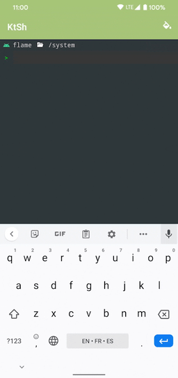

# KtSh

</a>

**An open source library to execute shell commands on Android or the JVM, written in Kotlin.**

<a target="_blank" href="LICENSE"></a>
<a target="_blank" href="https://travis-ci.org/jaredrummler/KtSh"></a>
<a target="_blank" href="https://maven-badges.herokuapp.com/maven-central/com.jaredrummler/ktsh"></a>
<a target="_blank" href="https://twitter.com/jaredrummler"></a>

# Downloads

Download [the latest JAR](https://repo1.maven.org/maven2/com/jaredrummler/ktsh/1.0.0/ktsh-1.0.0.jar) or grab via Gradle:

```groovy
implementation 'com.jaredrummler:ktsh:1.0.0'
```

Alternatively, you can simply copy [`Shell.kt`](library/src/main/kotlin/com/jaredrummler/ktsh/Shell.kt) file to your project.

# Usage

#### Basic usage:

```kotlin
val shell = Shell("sh")                         // create a shell
val result = shell.run("echo 'Hello, World!'")  // execute a command
if (result.isSuccess) {                         // check if the exit-code was 0
    println(result.stdout())                    // prints "Hello, World!"
}
```

#### Construct a new `Shell` instance:

```kotlin
// Construct a new shell instance with additional environment variables
val shell = Shell("sh", "USER" to "Chuck Norris", "ENV_VAR" to "VALUE")

// Construct a new shell instance with path to the shell:
val bash = Shell("/bin/bash")
```

Note: If the shell does not exist a `Shell.NotFoundException` is thrown as a `RuntimeException`.

#### Execute a command and get the result:

```kotlin
val shell = Shell.SH
val result: Shell.Command.Result = shell.run("ls")
```

A `Shell.Command.Result` contains the following:

- `stdout`:   A list of lines read from the standard input stream.
- `stderr`:   A list of lines read from the standard error stream.
- `exitCode`: The exit status from running the command.
- `details`:  Additional information (start, stop, elapsed time, id, command)

#### Add a callback when stdout or stderr is read:

```kotlin
shell.addOnStderrLineListener(object : Shell.OnLineListener {
  override fun onLine(line: String) {
      // do something
  }
})
```

#### Add a callback that is invoked each time a command completes:

```kotlin
shell.addOnCommandResultListener(object : Shell.OnCommandResultListener {
  override fun onResult(result: Shell.Command.Result) {
    // do something with the result
  }
})
```

#### Execute a command with custom options:

Optionally, you can configure how each command executes by setting a timeout, redirecting stderr to stdout, add callbacks for when the command reads a line from stdout/stderr or is cancelled.

```kotlin
// NOTE: all of these are optional
val result = Shell.SH.run(command) {
  // Kill the command after 1 minute
  timeout = Shell.Timeout(1, TimeUnit.MINUTES)
  // Redirect STDOUT to STDERR
  redirectErrorStream = false
  // Callbacks:
  onCancelled = {
    // The command was cancelled
  }
  onStdErr = { line: String ->
    // Do something when reading a line from standard error stream
  }
  onStdOut = { line: String ->
    // Do something when reading a line from standard output stream
  }
  // Do not notify any listeners added via Shell.addOnStderrLineListener and Shell.addOnStdoutLineListener
  notify = false
}
```

#### Check the state of the shell:

```kotlin
if (shell.isRunning()) {
  // The shell is running a command
} else if (shell.isShutdown()) {
  // The shell has been killed
} else if (shell.isIdle()) {
  // The shell is open and not running any commands
}
```

or

```kotlin
when (shell.state) {
  State.Idle -> TODO()
  State.Running -> TODO()
  State.Shutdown -> TODO()
}
```

#### Shutdown the shell

```kotlin
shell.shutdown()
```

#### Interrupt waiting for a command to complete:

```kotlin
shell.interrupt()
```

# Background processing on Android

Creating a new instance of a `Shell` or executing commands should be done on a separate thread other than the UI thread. This is up to the library user. An example of this can be found in the [demo](demo) project using Kotlin coroutines and AndroidX libraries:

```kotlin
fun run(
    shell: Shell,
    command: String,
    callback: (result: Shell.Command.Result) -> Unit
) = viewModelScope.launch {
    val result = withContext(Dispatchers.IO) { shell.run(command) }
    withContext(Dispatchers.Main) { callback(result) }
}

```
# Structure

* `buildSrc` - contains dependencies, plugins, versions for Gradle build logic
* `build.gradle.kts` - root gradle config file
* `settings.gradle.kts` - root gradle settings file
* `library` - the ktsh library
* `library/src/test` - unit tests for the library
* `demo` - Android demo project using ktsh
* `scripts` - scripts to publish library to maven central
* `.github` - any files for the github page

# Similar projects:

- [libsu](https://github.com/topjohnwu/libsu) by John Wu (topjohnwu)
- [libsuperuser](https://github.com/Chainfire/libsuperuser) by Jorrit Jongma (Chainfire)

# License

    Copyright (C) 2021 Jared Rummler

    Licensed under the Apache License, Version 2.0 (the "License");
    you may not use this file except in compliance with the License.
    You may obtain a copy of the License at

       http://www.apache.org/licenses/LICENSE-2.0

    Unless required by applicable law or agreed to in writing, software
    distributed under the License is distributed on an "AS IS" BASIS,
    WITHOUT WARRANTIES OR CONDITIONS OF ANY KIND, either express or implied.
    See the License for the specific language governing permissions and
    limitations under the License.
